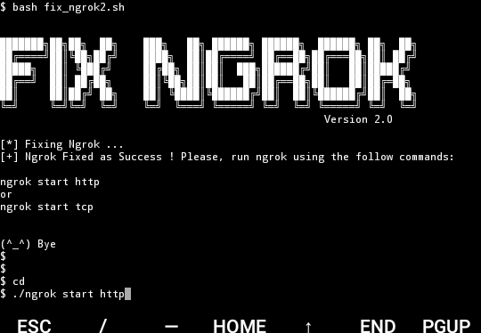
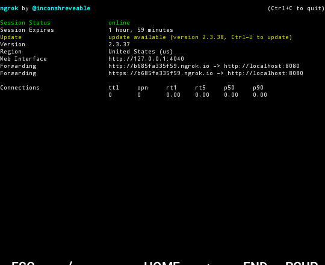

Fix Ngrok (version v 2.0)
===============================

Usage :
      
      $ apt-get update -y
      $ apt-get install git
      $ git clone https://github.com/f1gur4nt/fix_ngrok2
      $ cd fix_ngrok2
      $ chmod 755 fix_ngrok2.sh
      $ bash fix_ngrok2.sh

 

 
  

    
How you can see, ngrok are working!

Tested in:
Testado em:
      Termux 
      Linux Mint 

My ProtonMail: zuelbilah2@protonmail.com
